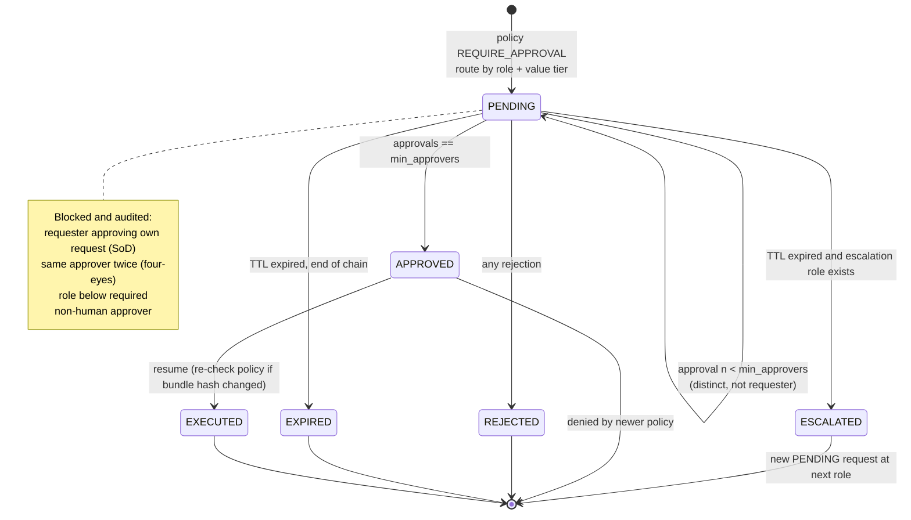

# Approval state machine

```mermaid
stateDiagram-v2
    [*] --> PENDING: policy REQUIRE_APPROVAL<br/>route by role + value tier
    PENDING --> PENDING: approval n < min_approvers<br/>(distinct, not requester)
    PENDING --> APPROVED: approvals == min_approvers
    PENDING --> REJECTED: any rejection
    PENDING --> ESCALATED: TTL expired and escalation role exists
    PENDING --> EXPIRED: TTL expired, end of chain
    ESCALATED --> [*]: new PENDING request at next role
    APPROVED --> EXECUTED: resume (re-check policy if bundle hash changed)
    APPROVED --> [*]: denied by newer policy
    REJECTED --> [*]
    EXPIRED --> [*]
    EXECUTED --> [*]
    note right of PENDING
      Blocked and audited:
      requester approving own request (SoD)
      same approver twice (four-eyes)
      role below required
      non-human approver
    end note
```
