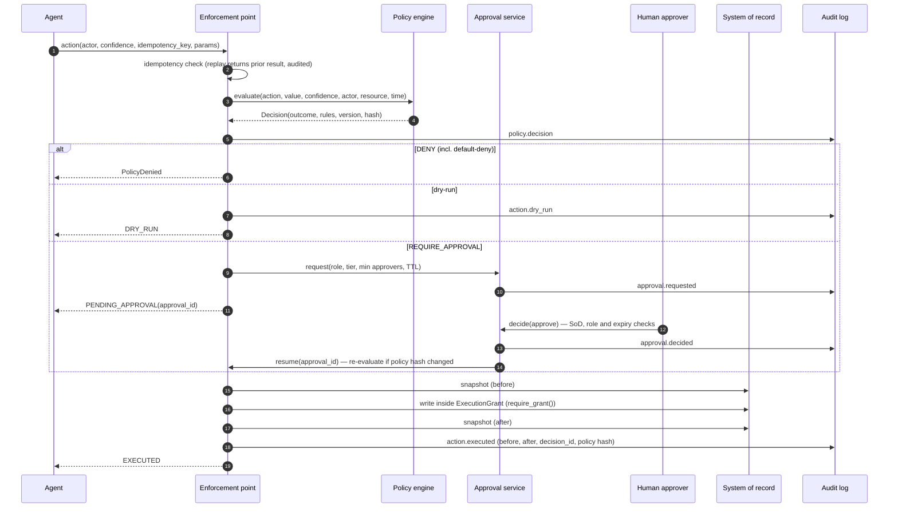

# Enforcement sequence

```mermaid
sequenceDiagram
    autonumber
    participant Ag as Agent
    participant G as Enforcement point
    participant P as Policy engine
    participant AP as Approval service
    participant H as Human approver
    participant SoR as System of record
    participant AU as Audit log
    Ag->>G: action(actor, confidence, idempotency_key, params)
    G->>G: idempotency check (replay returns prior result, audited)
    G->>P: evaluate(action, value, confidence, actor, resource, time)
    P-->>G: Decision(outcome, rules, version, hash)
    G->>AU: policy.decision
    alt DENY (incl. default-deny)
        G-->>Ag: PolicyDenied
    else dry-run
        G->>AU: action.dry_run
        G-->>Ag: DRY_RUN
    else REQUIRE_APPROVAL
        G->>AP: request(role, tier, min approvers, TTL)
        AP->>AU: approval.requested
        G-->>Ag: PENDING_APPROVAL(approval_id)
        H->>AP: decide(approve) — SoD, role and expiry checks
        AP->>AU: approval.decided
        AP->>G: resume(approval_id) — re-evaluate if policy hash changed
    end
    G->>SoR: snapshot (before)
    G->>SoR: write inside ExecutionGrant (require_grant())
    G->>SoR: snapshot (after)
    G->>AU: action.executed (before, after, decision_id, policy hash)
    G-->>Ag: EXECUTED
```
