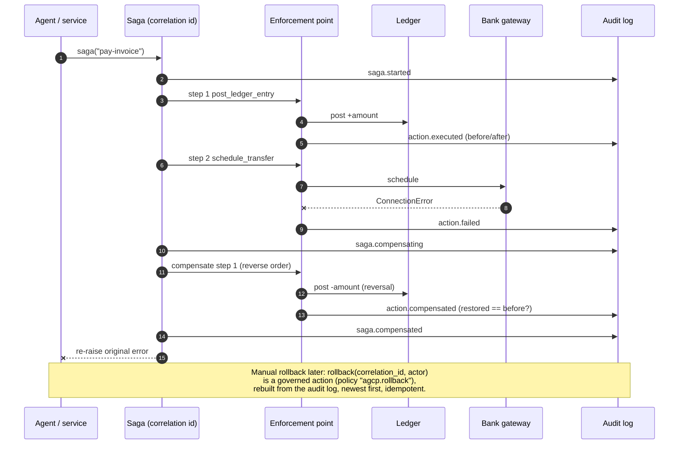

# Saga and rollback

```mermaid
sequenceDiagram
    autonumber
    participant Ag as Agent / service
    participant S as Saga (correlation id)
    participant G as Enforcement point
    participant L as Ledger
    participant B as Bank gateway
    participant AU as Audit log
    Ag->>S: saga("pay-invoice")
    S->>AU: saga.started
    S->>G: step 1 post_ledger_entry
    G->>L: post +amount
    G->>AU: action.executed (before/after)
    S->>G: step 2 schedule_transfer
    G->>B: schedule
    B--xG: ConnectionError
    G->>AU: action.failed
    S->>AU: saga.compensating
    S->>G: compensate step 1 (reverse order)
    G->>L: post -amount (reversal)
    G->>AU: action.compensated (restored == before?)
    S->>AU: saga.compensated
    S--xAg: re-raise original error
    Note over Ag,AU: Manual rollback later: rollback(correlation_id, actor)<br/>is a governed action (policy "agcp.rollback"),<br/>rebuilt from the audit log, newest first, idempotent.
```
